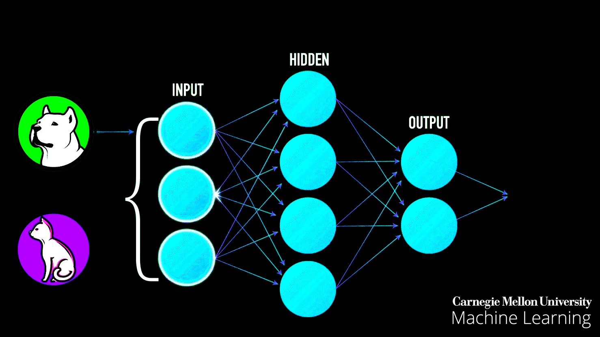

# Intro to the Foundations of Deep Learning

### Summary

My goal is to make deep learning accessible and empower you to solve real-world problems with it. You don't need a Ph.D. to benefit from deep learning, nor do you need to be a mathematical wizard to grasp it. You do need this: an open mind, a passion for learning, and a desire to understand the world around you.

I teach the course in a _top-down learning_ fashion. Each lesson contains some new material and a practical application of it on real-world data. I present concepts at a high-level and opt to omit a few fine-grained details about them that might have stunted rather than promoted your understanding. I do this because my priority is to develop your intuition for deep learning concepts first. I believe it's easier to learn the maths behind these concepts afterward.

_Course outline:_
We start our journey by learning linear regression - a fundamental algorithm in machine learning. Next, we reframe linear regression as a special case of a deep learning network called a single-layer linear neural network. Here, we walk through building neural networks from scratch and show how to train and evaluate them. Later, we introduce logistic regression - an extension of linear regression - to solve classification problems. We then explore deep neural networks and see that they can achieve impressive results on classification tasks such as handwritten digit recognition. Armed with your newfound understanding, you will be able to build deep neural networks and apply them to solve various regression and classification problems. And you can leverage your strong deep learning foundation to learn advanced methods!

Some of the data science tool we will work with include: [Pandas](./basics/Basics_Pandas.ipynb) and [NumPy](./basics/Basics_NumPy.ipynb) (for manipulating data), [Matplotlib's Pyplot](./basics/Basic_Matplotlib_Pyplot.ipynb) (for visualizing data), and [Tensorflow](https://www.tensorflow.org/) and [PyTorch](https://pytorch.org/) (for building and training machine learning models).

**Always Open in Colab** - many of the lessons contain images that do not show on Github. Always click the button to 'Open in Colab' when viewing a notebook to get the best learning experience.

## Lesson 0: Introduction to Deep Learning Concepts

**Learning Objective:** learn at the highest level the fundamental terminology and concepts behind deep learning.

- [Video: Intro to Google Colab (~5 min)](https://www.youtube.com/watch?v=inN8seMm7UI)
- [Terminology and Concepts Introduction](./machine_learning/lesson%200%20-%20machine%20learning/Intro_to_Machine_Learning.ipynb)
- [Gradio MNIST](./machine_learning/lesson%200%20-%20machine%20learning/Gradio_MNIST_Tutorial.ipynb)

## Lesson 1: Linear Regression

**Learning Objective:** Understand how to build, train, and evaluate single-layer linear neural networks to solve regression problems.

- [Single-variable Linear Regression](./machine_learning/lesson%201%20-%20linear%20regression/examples/From_Linear_Regression_to_Deep_Learning.ipynb)

  - _Pre-lesson:_ [Video: Crash Course - Linear Regression (~13 min)](https://www.youtube.com/watch?v=WWqE7YHR4Jc&t=13s)
  - _Other resources:_ [Pandas Basics](./basics/Basics_Pandas.ipynb), [Sklearn Basics](./basics/Basics_Sklearn.ipynb), [Matplotlib Pyplot Basics](./basics/Basic_Matplotlib_Pyplot.ipynb), [NumPy Basics](./basics/Basics_NumPy.ipynb)
  - _Challenges:_
    - [Predict you school's comedy show attendance (First challenge from the Single-variable Linear Regression Colab lesson)](./machine_learning/lesson%201%20-%20linear%20regression/examples/From_Linear_Regression_to_Deep_Learning.ipynb)

- [Cleaning and Preparing Data](./machine_learning/mini_lessons/Cleaning_Data.ipynb)

  - _Challenges:_
    - [Cleaning and Preparing your own dataset](./machine_learning/mini_lessons/cleaning_and_preparing_your_own_dataset.ipynb)
    - [Single-variable Linear Regression with student's dataset](./machine_learning/lesson%201%20-%20linear%20regression/challenges/simple-linear-regression-2.ipynb)

- [Single-variable Linear Regression as Neural Networks, a Deep Learning Perspective](./machine_learning/lesson%201%20-%20linear%20regression/examples/linear-regression-deep-dive.ipynb)

  - _Challenges:_
    - [Revisiting Single-variable Linear Regression with Pokemon](./machine_learning/lesson%201%20-%20linear%20regression/challenges/revisting-simple-linear-regression-pokemon.ipynb)
    - [Revisiting Single-variable Linear Regression with Student's dataset](./machine_learning/lesson%201%20-%20linear%20regression/challenges/simple-linear-regression-2-revisited.ipynb)

- [Multiple Linear Regression](./machine_learning/lesson%201%20-%20linear%20regression/examples/multiple-linear-regression.ipynb)
  - _Challenges:_
    - [Multiple Linear Regression with Pokemon data](./machine_learning/lesson%201%20-%20linear%20regression/challenges/multiple-linear-regression-pokemon.ipynb)
    - [Multiple Linear Regression with student's dataset](./machine_learning/lesson%201%20-%20linear%20regression/challenges/multiple-linear-regression-2.ipynb)

## Lesson 2: Classification with Logistic and Softmax Regression

**Learning Objective:** understand how to build, train, and evaluate single-layer linear neural networks to solve binary and multi-class classification problems.

- [Logistic Regression Classifier](./machine_learning/lesson%202%20-%20logistic%20regression/logistic-regression.ipynb)

  - _Pre-lesson:_ [Video: Logistic Regression (~9 min)](https://www.youtube.com/watch?v=yIYKR4sgzI8)
  - _Other resources:_ [Beyond Accuracy: Precision and Recall](https://towardsdatascience.com/beyond-accuracy-precision-and-recall-3da06bea9f6c)
  - _Challenges:_
    - [Logistic Regression with Pokemon](./machine_learning/lesson%202%20-%20logistic%20regression/challenges/logistic-regression-pokemon.ipynb)
    - [Logistic Regression with student's dataset](./machine_learning/lesson%202%20-%20logistic%20regression/challenges/logistic-regression-2.ipynb)

- [Softmax Regression Classifier](./machine_learning/lesson%202%20-%20logistic%20regression/softmax-regression.ipynb)

  - _Challenges:_
    - [Softmax Regression with Pokemon](./machine_learning/lesson%202%20-%20logistic%20regression/challenges/softmax-regression-pokemon.ipynb)

- [How to prepare image data for neural networks](./machine_learning/mini_lessons/image_data.ipynb)
  - _Challenges:_
    - [Softmax regression with student's dataset](./machine_learning/lesson%202%20-%20logistic%20regression/challenges/softmax-regression-2.ipynb)

## Lesson 3: Image Classification with Deep Neural Networks

**Learning Objective:** understand how to build, train, and evaluate deep linear neural networks to solve regression and classification problems.

- [Introduction to Deep Linear Neural Networks](./machine_learning/lesson%203%20-%20Neural%20Networks/intro-to-neural-networks.ipynb)

  - _Pre-lesson:_ [Video: 3blue1Brown - But What is a Neural Network? (~19 min)](https://www.youtube.com/watch?v=aircAruvnKk)
  - _Other resources:_ [Blog post: Jay Alammar - A visual guide to the basics of Neural Networks (level: intermediate)](http://jalammar.github.io/visual-interactive-guide-basics-neural-networks/), [Blog post: Jay Alammar - A visual guide to the math behind the basics of Neural Networks (level: intermediate)](https://jalammar.github.io/feedforward-neural-networks-visual-interactive/)
  - _Challenges:_
    - [Feed Forward Neural Network with Fashion-MNIST](./machine_learning/lesson%203%20-%20Neural%20Networks/challenges/neural_networks_1.ipynb)

- [Using external image datasets in Colab](./machine_learning/mini_lessons/external-datasets-in-colab.ipynb)
  - _Challenges:_
    - [Neural Network with your own image dataset](./machine_learning/lesson%203%20-%20Neural%20Networks/challenges/neural_networks_own_data.ipynb)

## Advanced Deep Learning Resources

**Learning Objective:** continue learning about deep learning!

- [Lecture: MIT Deep Learning Basics](https://www.youtube.com/watch?v=O5xeyoRL95U&list=PLrAXtmErZgOeiKm4sgNOknGvNjby9efdf)
- [Course: Fastai](https://course.fast.ai/)
- [Book: Dive into Deep Learning](https://d2l.ai/index.html)

### Other resources

- [Video: Intro to Google Colab (~5 min)](https://www.youtube.com/watch?v=inN8seMm7UI), [Notebook: Intro to Google Colab](https://colab.research.google.com/notebooks/welcome.ipynb#scrollTo=5fCEDCU_qrC0)
- [Pandas Basics](../basics/Basics_Pandas.ipynb)
- [Matplotlib Pyplot Basics](../basics/Basic_Matplotlib_Pyplot.ipynb)
- [Graphing Basics](../basics/Basics_Graphing.ipynb)
- [Sklearn Basics](../basics/Basics_Sklearn.ipynb)
- [NumPy Basics](../basics/Basics_NumPy.ipynb)
- [Beyond Accuracy: Precision and Recall](https://towardsdatascience.com/beyond-accuracy-precision-and-recall-3da06bea9f6c)
- [Video Series: 3Blue1Brown - Neural Networks (4 videos)](https://www.youtube.com/playlist?list=PLZHQObOWTQDNU6R1_67000Dx_ZCJB-3pi)
- [Blog post: Jay Alammar's visual guide to the basics of Neural Networks (level: intermediate)](http://jalammar.github.io/visual-interactive-guide-basics-neural-networks/)
- [Blog post: Jay Alammar's visual guide to the math behind the basics of Neural Networks (level: intermediate)](https://jalammar.github.io/feedforward-neural-networks-visual-interactive/)
- [CNN Explainer](https://poloclub.github.io/cnn-explainer/)
